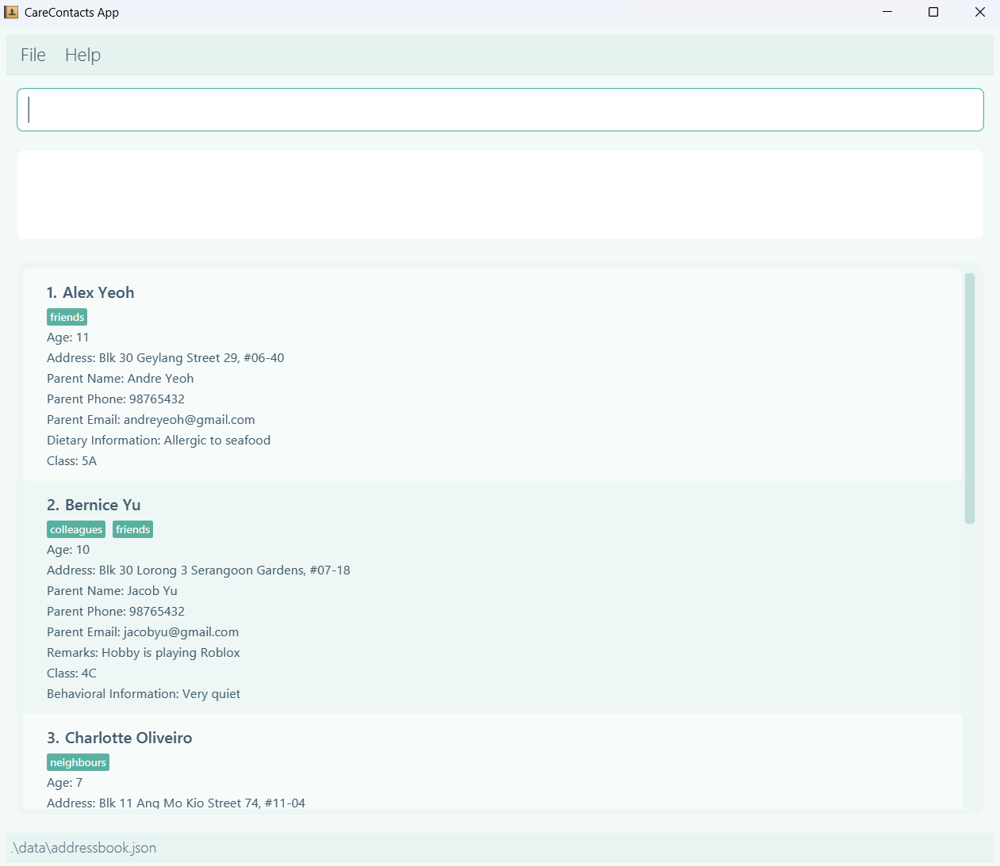
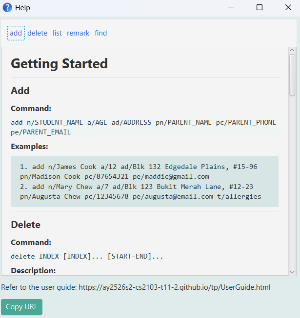
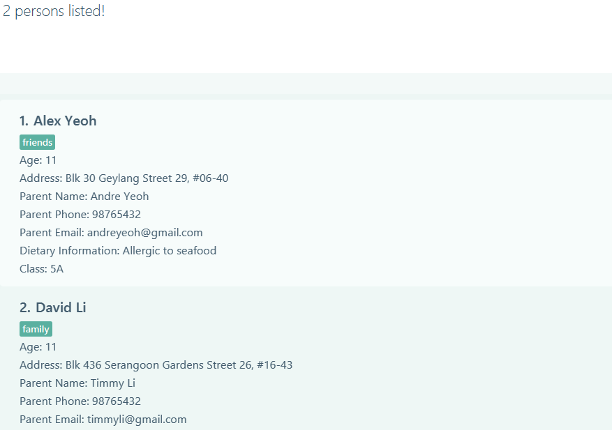

# CareContacts User Guide

CareContacts is a desktop student management application designed specifically for Student Care Supervisors. **It is optimized for a Command Line Interface** (CLI) and for fast typists.

<!-- * Table of Contents -->
<page-nav-print />

--------------------------------------------------------------------------------------------------------------------

## Quick start

1. Ensure you have Java `17` or above installed in your Computer. 
   **Mac users:** Ensure you have the precise JDK version prescribed [here](https://se-education.org/guides/tutorials/javaInstallationMac.html).

1. Download the latest `.jar` file from [here](https://github.com/AY2526S2-CS2103-T11-2/tp/releases).

1. Copy the file to the folder you want to use as the _home folder_ for your AddressBook.

1. Open a command terminal, `cd` into the folder you put the jar file in, and use the `java -jar carecontacts.jar` command to run the application. 
   A GUI similar to the below should appear in a few seconds. Note how the app contains some sample data. 
   

1. Type the command in the command box and press Enter to execute it. e.g. typing **`help`** and pressing Enter will open the help window. 
   Some example commands you can try:

   * `list` : Lists all contacts.

   * `add n/John Doe p/98765432 e/johnd@example.com a/John street, block 123, #01-01` : Adds a contact named `John Doe` to the Address Book.

   * `delete 3` : Deletes the 3rd contact shown in the current list.

   * `clear` : Deletes all contacts.

   * `exit` : Exits the app.

1. Refer to the [Features](#features) below for details of each command.

--------------------------------------------------------------------------------------------------------------------

## Features

<box type="info" seamless>

**Notes about the command format:** 

* Words in `UPPER_CASE` are the parameters to be supplied by the user. 
  e.g. in `add n/NAME`, `NAME` is a parameter which can be used as `add n/John Doe`.

* Items in square brackets are optional. 
  e.g `n/NAME [t/TAG]` can be used as `n/John Doe t/friend` or as `n/John Doe`.

* Items with `…`​ after them can be used multiple times including zero times. 
  e.g. `[t/TAG]…​` can be used as ` ` (i.e. 0 times), `t/friend`, `t/friend t/family` etc.

* Items separated by `|` are mutually exclusive options; you may pick at most one option.

* Parameters can be in any order. 
  e.g. if the command specifies `n/NAME p/PHONE_NUMBER`, `p/PHONE_NUMBER n/NAME` is also acceptable.

* Extraneous parameters for commands that do not take in parameters (such as `help`, `exit` and `clear`) will be ignored. 
  e.g. if the command specifies `help 123`, it will be interpreted as `help`.

* If you are using a PDF version of this document, be careful when copying and pasting commands that span multiple lines as space characters surrounding line-breaks may be omitted when copied over to the application.
</box>

### Viewing help : `help`

Shows a help window with a small set of essential commands to help new users get started quickly.

⚠️ Important:

This help window is not a complete reference of all available commands.
Some commands (e.g., edit, import, etc.) are not included.
For the full list of features and commands, refer to the User Guide.

Format: help

Format: `help`

### Adding a person: `add`

Adds a student to the address book.

Format: `add n/STUDENT_NAME a/AGE ad/ADDRESS pn/PARENT_NAME pc/PARENT_PHONE pe/PARENT_EMAIL [t/TAG]...`

<box type="tip" seamless>

**Tip:** A person can have any number of tags (including 0)
</box>

Examples:
* `add n/James Cook a/12 ad/Blk 132 Edgedale Plains, #15-96 pn/Madison Cook pc/87654321 pe/maddie@gmail.com`
* `add n/Mary Chew a/7 ad/Blk 123 Bukit Merah Lane, #12-23 pn/Augusta Chew pc/12345678 pe/augusta@email.com t/allergies t/basketball`

### Duplicate name detection

If a student whose name matches an existing name after normalization is added, the system will display a warning and show a list of similar names. However, the student will still be added.

A name is considered a match after normalization if the name is the same after:

* Differences in capitalization are ignored
* Extra spaces are removed

For example, `John Doe` and `john   doe  ` are treated as the same name.

Limitations:

This check is limited and may miss some similar names
For example:
* `Justine Ong` vs `Justin Ong` will not trigger a warning
* `Annabelle` vs `Anna Belle` will not trigger a warning

### Listing all persons : `list`

Shows a list of all persons in the address book.

Format: `list  [n/] | [a/] | [pn/] | [pc/] | [pe/]`

* If a prefix is provided, the list is sorted by that field.
* If no prefix is given, students are shown in the default order.
* Only one prefix can be used at a time.
* Alphabetical sort is applied to `n/`, `pn/` and `pe/`.
* Numeric sort in ascending order is applied to `a/` and `pc/`.

### Editing a person : `edit`

Edits an existing person in the address book.

Format: `edit INDEX [n/NAME] [a/AGE] [ad/ADDRESS] [pn/PARENT NAME] [pc/PARENT PHONE] [pe/PARENT EMAIL] [t/TAG]...`

* Edits the person at the specified `INDEX`. The index refers to the index number shown in the displayed person list. The index **must be a positive integer** 1, 2, 3, …​
* At least one of the optional fields must be provided.
* Existing values will be updated to the input values.
* When editing tags, the existing tags of the person will be removed i.e adding of tags is not cumulative.
* You can remove all the person’s tags by typing `t/` without
    specifying any tags after it.

Examples:
*  `edit 2 n/Betsy Crower t/` Edits the name of the 2nd person to be `Betsy Crower` and clears all existing tags.
*  `edit 3 pn/91234567 pe/johndoe@example.com` Edits the phone number and email address of the 3rd person's parent to be `91234567` and `johndoe@example.com` respectively.

### Locating persons by name: `find`

Filter students based on matching keywords to specified fields.

Format: `find [NAME] [n/NAME] [a/AGE] [ad/ADDRESS] [t/TAG] [pn/PARENT_NAME] [pc/PARENT_PHONE] [pe/PARENT_EMAIL] [d/DIETARY] [c/CLASS] [b/BEHAVIOR]`

* The search is case-insensitive. e.g `hans` will match `Hans`
* The order of the keywords does not matter. e.g. `Hans Bo` will match `Bo Hans`
* If the keyword follows the prefix, the search returns contacts that match ANY of the given keywords (OR search) if they match the specified parameter for the specific prefix.
* If no prefix is specified (e.g., n/, a/, pn/, pe/), the search will default to student name (n/).
* The search matches partial words (e.g., `jacob` will match `jacobyu@email.com`, `Justin` will match `Justinian`) except for the age prefix.
* Searching by age uses an exact match instead of a partial match (e.g., a/12 will not match a student who is 1).
* Persons matching at least one keyword will be returned (i.e. `OR` search).
  e.g. `Hans Bo` will return `Hans Gruber`, `Bo Yang`
* At least one of the optional fields must be provided.
* If a prefix is provided, then it must not be empty (e.g., `find n/` will result in an error).
* Use the `list` command to return to the full list after using find.

Examples:
* `find John` returns `john` and `John Doe`
* `find alex david` returns `Alex Yeoh`, `David Li` 
* `find alex david n/john` returns `Alex Yeoh`, `David Li`, and `John Doe`
* `find n/Jacob pn/Madison` returns students whose name contains `Jacob` and students whose parent's name contains `Madison`
  
* `find n/Alice pn/Tan a/12` returns all students named `Alice`, and students whose parent's name contains `Tan`, and students who are exactly 12 years old.

### Deleting a student : `delete`

Deletes the specified student from the address book.

Format: `delete INDEX [INDEX]... [START-END]...`

* Deletes the students at the specified `INDEX` or in the specified range `START-END`.
* The index refers to the index number shown in the displayed person list.
* The index **must be a positive integer** 1, 2, 3, ...
* Supports bulk deletion by providing multiple indices and/or ranges.
* Ranges are inclusive (e.g. 3-5 deletes indices 3, 4, and 5).
* Indices and ranges can be combined (e.g. 1 3 5-7).

Examples:
* `list` followed by `delete 2` deletes the 2nd person in the address book.
* `find Betsy` followed by `delete 1` deletes the 1st person in the results of the `find` command.

### Adding or removing a remark from a student : `remark`

Adds a remark to the specified student from CareContacts.

Format: `remark INDEX r/[REMARK] d/[DIETARY REMARK] b/[BEHAVIOR REMARK] c/[CLASS]`

* Adds a remark to a student at the specified `INDEX`.
* The index refers to the index number shown in the displayed person list.
* The index **must be a positive integer** 1, 2, 3, ...
* Existing remarks will be overwritten by the new values.
* You must provide at least one prefix (r/, d/, c/, or b/).
* To delete a remark, use the prefix with no value (e.g. remark 1 r/).

Examples:
* `remark 1 d/` removes the dietary remark from the student at index 1
* `remark 1 r/enjoys sports d/allergic to shellfish c/1C b/very energetic`
adds the following remarks to the student at index 1

### Importing students : `import`

Imports students from a CSV file into the address book.

Format: `import FILE_PATH`

* `FILE_PATH` can be relative (e.g. `data/contacts.csv`) or absolute.
* If the path contains spaces, wrap it in quotes.
  e.g. `import "data/my contacts.csv"`
* The CSV must contain these fixed columns in this order:
  * `0=name`
  * `1=age`
  * `2=address`
  * `3=parentName`
  * `4=parentPhone`
  * `5=parentEmail`
  * `6=tags`
  * `7=remark`
  * `8=dietaryRemark`
  * `9=classRemark`
  * `10=behaviorRemark`
* Optional fields (`tags`, `remark`, `dietaryRemark`, `classRemark`, `behaviorRemark`) can be left empty.
* If tags are present, separate them with semicolons `;` in the tags column.
* Duplicate students (same identity) are skipped and reported in the command result.

Examples:
* `import data/contacts.csv`
* `import "data/term 2/students.csv"`

### Clearing all entries : `clear`

Clears all entries from the address book.

Format: `clear`

### Exiting the program : `exit`

Exits the program.

Format: `exit`

### Saving the data

CareContacts data are saved in the hard disk automatically after any command that changes the data. There is no need to save manually.

### Importing the data

Use the `import` command to load students from a CSV file:

* `import data/contacts.csv`

Refer to [Importing students : `import`](#importing-students--import) for the required CSV format.

### Editing the data file

CareContacts data are saved automatically as a JSON file `[JAR file location]/data/addressbook.json`. Advanced users are welcome to update data directly by editing that data file.

<box type="warning" seamless>

**Caution:**
If your changes to the data file makes its format invalid, CareContacts will discard all data and start with an empty data file at the next run.  Hence, it is recommended to take a backup of the file before editing it. 
Furthermore, certain edits can cause the CareContacts to behave in unexpected ways (e.g., if a value entered is outside the acceptable range). Therefore, edit the data file only if you are confident that you can update it correctly.
</box>

### Archiving data files `[coming in v2.0]`

_Details coming soon ..._

--------------------------------------------------------------------------------------------------------------------

## FAQ

**Q**: How do I transfer my data to another Computer? 
**A**: Install the app in the other computer and overwrite the empty data file it creates with the file that contains the data of your previous CareContacts home folder.

--------------------------------------------------------------------------------------------------------------------

## Known issues

1. **When using multiple screens**, if you move the application to a secondary screen, and later switch to using only the primary screen, the GUI will open off-screen. The remedy is to delete the `preferences.json` file created by the application before running the application again.
2. **If you minimize the Help Window** and then run the `help` command (or use the `Help` menu, or the keyboard shortcut `F1`) again, the original Help Window will remain minimized, and no new Help Window will appear. The remedy is to manually restore the minimized Help Window.

--------------------------------------------------------------------------------------------------------------------

## Command summary

Action     | Format, Examples
-----------|--------------------------------------------------------------------------------------------------------------------------------------------------------------------------------------------------------------
**Help**   | `help`
**Add**    | `add n/STUDENT_NAME a/AGE ad/ADDRESS pn/PARENT_NAME pc/PARENT_PHONE pe/PARENT_EMAIL [t/TAG]...`   e.g., `add n/James Ho a/12 ad/Kent Ridge Street pn/Bryan Ho pc/98765432 pe/bryan@example.com t/student`
**List**   | `list [n/] \| [a/] \| [pn/] \| [pc/] \| [pe/]`   e.g., `list a/`
**Edit**   | `edit INDEX [n/NAME] [a/AGE] [ad/ADDRESS] [pn/PARENT NAME] [pc/PARENT PHONE] [pe/PARENT EMAIL] [t/TAG]...`  e.g.,`edit 2 pn/James Lee pe/jameslee@example.com`
**Find**   | `find [NAME] [n/NAME] [a/AGE] [ad/ADDRESS] [t/TAG] [pn/PARENT_NAME] [pc/PARENT_PHONE] [pe/PARENT_EMAIL] [d/DIETARY] [c/CLASS] [b/BEHAVIOR]`  e.g., `find James pn/Jake`
**Delete** | `delete INDEX [INDEX]... [START-END]...`  e.g., `delete 1 2 4-6`
**Remark** | `remark INDEX r/[REMARK] d/[DIETARY REMARK] b/[BEHAVIOR REMARK] c/[CLASS]`   e.g., `remark 3 c/4A d/Allergic to seafood`
**Import** | `import FILE_PATH`  e.g., `import data/contacts.csv`
**Clear**  | `clear`
